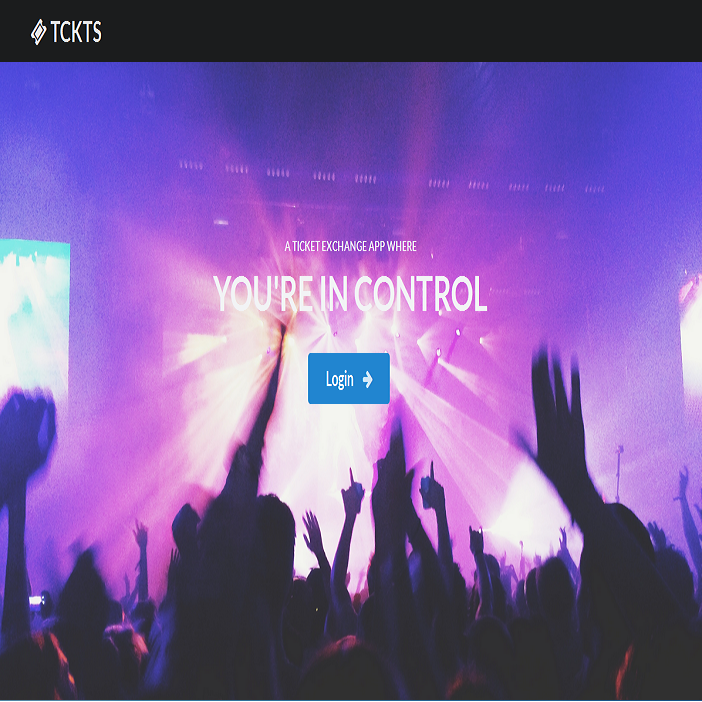

<a href="https://manoa-tckts.github.io/" target="_blank"><i class="large github icon"></i>Manoa TCKTS</a>

Manoa-Tckts is an application created to allow users within the University of Hawaii System a safe outlet to buy tickets from promoters and other students.
This application requires the user log in through a University of Hawaii account in order to use its functionality.  The forced login
through the University of Hawaii system is to act as a deterrent for scams or bad behavior during the ticket exchange.

This application is a Final Group Project for ICS 314 that was done in collaboration with three other students.  The projects purpose was
to provide a way to showcase what we have learned througout the course by using JavaScript, HTML, CSS, Underscore, Semantic UI, and Meteor while creating 
a application which can be used in the future by University of Hawaii students.

Officially our group assigned each member a set of tasks to be completed.  However as students we understood that each of us had other classes, jobs friends
and other commitments as well and we all were very accommodating torwards that fact.  So while each of us had sets of tasks assigned to us
mine being anything having to do with User and profile functionality, each of us had to at times take a leadership role, help other members, and go
above and beyond what we were just assigned to do.  It was an interesting and good experience that I'm sure forced all of us out of any comfort zone as problems
we faced during this project will most likely be faced in the future.

The Development Team

* <a href="https://dumlaoj.github.io/" target="_blank"> Jordan Dumlao</a>
 
* <a href="https://kylebali.github.io/" target="_blank"> Kyle Balisacan</a>
 
* <a href="https://brandon-chun.github.io/" target="_blank"> Brandon Chun</a>
 
* <a href="https://brentnunogawa.github.io/" target="_blank"> Brent Nunogawa</a>
 

